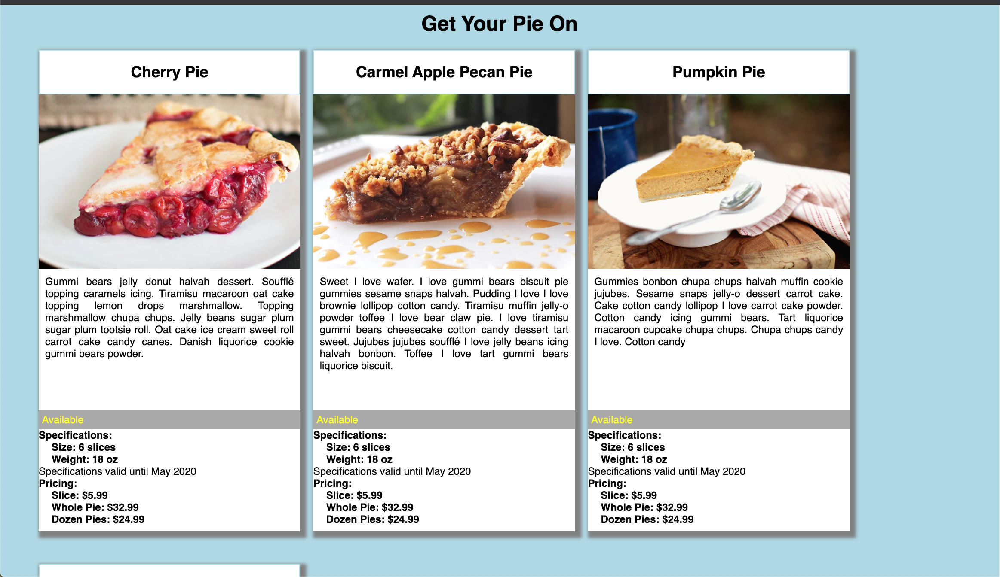

# README.md
    # product-cards
    ## Description 
    Get Your Pie On is a website that list available pies from a mock pie company. It lists available pies, whether the pie is availabe for purchase, specifications for the pies and prices for purchasing.
    (./screenshots/cardView.png)
    ## How to Run 
    1. Clone down this repo
    1. Make sure you have http-server install via npm. If not get it [HERE] (https://www.npmjs.com/package/http-server).
    1. On your command line run `hs -p 9999`
    1. In your browswer go to `http://localhost:localhost:9999`